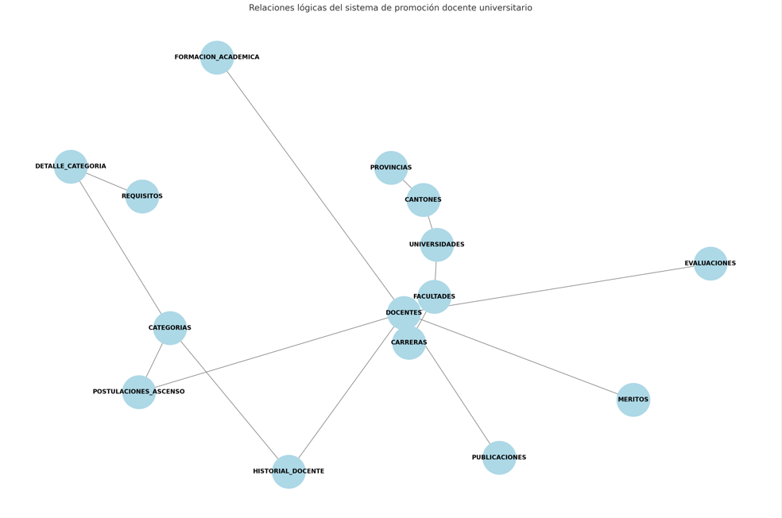
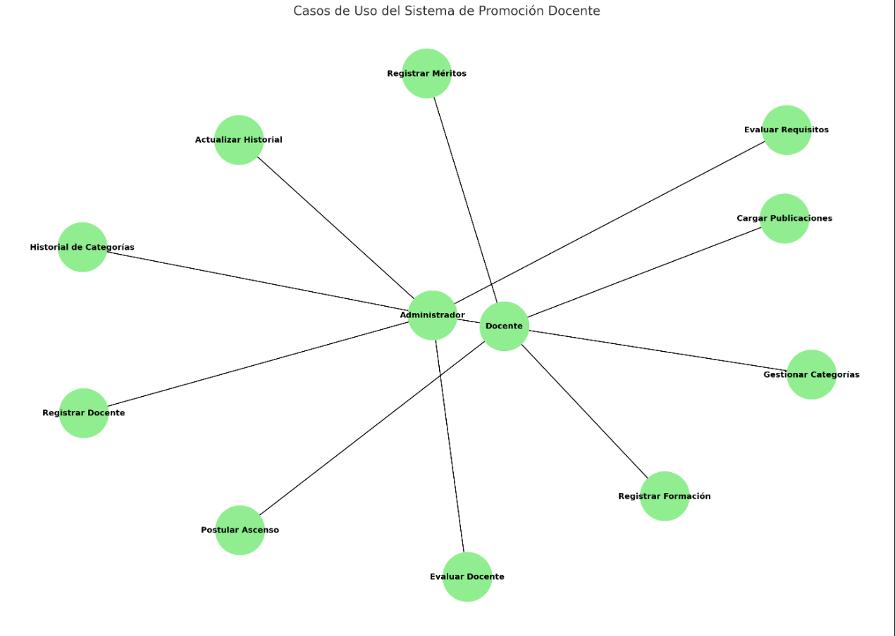
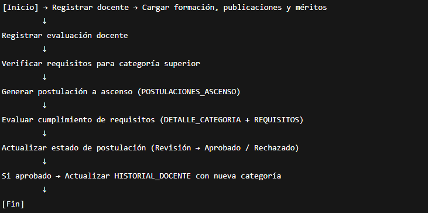

PROVINCIAS

ID_PRO | NOM_PRO | -> ID PROVINCIA | NOMBRE PROVINCIA |

CREATE TABLE PROVINCIAS (
    ID_PRO VARCHAR(10) PRIMARY KEY,
    NOM_PRO VARCHAR(40) NOT NULL,
);

CANTONES

ID_CAN | NOM_CAN | ID_PRO -> ID CANTON | NOMBRE CANTON | ID PROVINCIA

CREATE TABLE CANTONES (
    ID_CAN VARCHAR(10) PRIMARY KEY,
    NOM_CAN VARCHAR(40) NOT NULL,
    ID_PRO NOT NULL REFERENCES PROVINCIAS(ID_PRO)
);

UNIVERSIDADES

ID_UNI | NOM_UNI |DIR_UNI | TEL_UNI | ID_CAN| -> ID UNIVERSIDAD | NOMBRE UNIVERSIDAD | 
DIRECCION UNIVERSIDAD | TELEFONO UNIVERSIDAD | ID CANTON

CREATE TABLE UNIVERSIDADES (
    ID_UNI VARCHAR(10) PRIMARY KEY,
    NOM_UNI VARCHAR(60) NOT NULL,
    DIR_UNI VARCHAR(50) NOT NULL,
    TEL_UNI INT NOT NULL,
    ID_CAN NOT NULL REFERENCES CANTONES(ID_CAN)
);

FACULTADES

ID_FAC | NOM_FAC | UBI_PRE_FAC | MIS_FAC | VIC_FAC |ID_UNI -> |ID DE LA FACULTAD| NOMBRE DE LA FACULTAD|
UBICACION DEL PREDIO DE LA FACULTAD| MISION DE LA FACULTAD | VISION DE LA FACULTAD | ID UNIVERSIDAD

CREATE TABLE FACULTADES (
    ID_FAC VARCHAR(10) PRIMARY KEY,
    NOM_FAC VARCHAR(30) NOT NULL,
    UBI_PRE_FAC VARCHAR(15) CHECK (UBI_PRE_FAC IN ('HUACHI','INGAURCO','QUEROCHACA')),
    MIS_FAC VARCHAR(255) NOT NULL,
    VIC_FAC VARCHAR(255) NOT NULL,
    ID_UNI NOT NULL REFERENCES UNIVERSIDADES(ID_UNI)
);

CARRERAS

ID_CAR | NOM_CAR | ID_FAC | -> |ID DE LA CARRERA| NOMBRE DE LA CARRERA| ID DE LA FACULTAD|

CREATE TABLE CARRERAS (
    ID_CAR VARCHAR(10) PRIMARY KEY,
    NOM_CAR VARCHAR(25) NOT NULL,
    ID_FAC NOT NULL REFERENCES FACULTADES(ID_FAC)
);

DOCENTES

CED_DOC | NOM_DOC | APE_DOC |TEL_DOC | URL_CED_DOC | FEC_ING | FEC_NAC  -> |CEDULA DEL DOCENTE | NOMBRE DEL DOCENTE|
APELLIDO DEL DOCENTE | TELEFONO DEL DOCENTE | FECHA DE INGRESO | FECHA DE NACIMIENTO | TITULO ACADEMICO MAXIMO(QUE POSEE) |
ID CARRERA DONDE TRABAJA (ACTUALMENTE)

CREATE TABLE DOCENTES (
    CED_DOC VARCHAR(10) PRIMARY KEY,
    NOM_DOC VARCHAR(20) NOT NULL,
    APE_DOC VARCHAR(20) NOT NULL,
    TEL_DOC VARCHAR(10) NOT NULL,
    URL_CED_DOC VARCHAR(255) NOT NULL,
    FEC_ING DATE NOT NULL,
    FEC_NAC DATE NOT NULL,
    TIT_ACA_MAX VARCHAR(50),
    ID_CAR NOT NULL REFERENCES CARRERAS(ID_CAR)
);

EVALUACIONES

NUM_EVA | NUM_RES_EVA | FEC_EVA | CAL_EVA | ARC_EVA |CED_DOC | -> | NUMERO DE RESOLUCION DE LA EVALUACION | FECHA DE LA EVALUACION | 
CALIFICACION DE EVALUACION | CEDULA DEL DOCENTE | ARCHIVO |

CREATE TABLE EVALUACIONES (
    NUM_EVA INT PRIMARY KEY,
    NUM_RES_EVA VARCHAR(11) NOT NULL,
    FEC_EVA DATE NOT NULL,
    CAL_EVA DECIMAL(4,2) NOT NULL,
    CED_DOC NOT NULL REFERENCES DOCENTES(CED_DOC)
    ARC_EVA VARBINARY,
);

CATEGORÍAS 

ID_CAT | NOM_CAT | DES_CAT | NIV_CAT | REQ_CAT | -> ID CATEGORIA | NOMBRE CATEGORIA | DESCRIPCION CATEGORIA | NIVEL DE CATEGORIA|
REQUISITOS DE LA CATEGORIA (T1 ..... T5)

CREATE TABLE CATEGORIAS (
    ID_CAT VARCHAR(5) PRIMARY KEY,
    NOM_CAT VARCHAR(10) NOT NULL,
    DES_CAT VARCHAR(225) NOT NULL,
    NIV_CAT INT UNIQUE,
    REQ_CAT VARCHAR(225) NOT NULL
);

REQUISITOS

ID_REQ | DES_REQ | TIP_REQ | PUN_REQ | -> ID DEL REQUISITO | DESCRIPCION DEL REQUISITO | TIP_REQUISITO (EVALUACION,FORMACION....)|
PUNTUACION REQUERIDA |

CREATE TABLE REQUISITOS (
    ID_REQ VARCHAR(5) PRIMARY KEY,
    DES_REQ VARCHAR(225) NOT NULL,
    TIP_REQ VARCHAR(20), 
    PUN_REQDECIMAL(4,2)
);

DETALLE_CATEGORIA

ID_DTC | ID_CAT | ID_REQ | OBS_DTC | -> ID DEL DETALLE CATEGORIA | ID DE LA CATEGORIA | ID DEL REQUERIMIENTO | 

CREATE TABLE DETALLE_CATEGORIA(
    ID_DTC PRIMARY KEY,
    ID_CAT NOT NULL REFERENCES CATEGORIAS(ID_CAT),
    ID_REQ NOT NULL REFERENCES REQUISITOS(ID_REQ),
);

HISTORIAL_DOCENTE 

ID_HIS | CED_DOC | ID_CAT | FEC_INI | FEC_FIN |

CREATE TABLE HISTORIAL_DOCENTE (
    ID_HIS NUMBER PRIMARY KEY,
    CED_DOC NOT NULL REFERENCES DOCENTES(CED_DOC),
    ID_CAT NOT NULL REFERENCES CATEGORIAS(ID_CAT ),
    FEC_INI DATE NOT NULL,
    FEC_FIN DATE 
);

FORMACION ACADEMICA

ID_FOR | CED_DOC | TIT_ACA | NIV_FOR | INS_FOR | FEC_FOR -> ID FORMACION | CEDULA DOCENTE | TITULO ACADEMICO | NIVEL DE FORMACION
INSTITUCION DE FORMACION (NO HAGO RELACION POR QUE PUEDE QUE SEA TITULADO FUERA) | FECHA DE LA FORMACION 

CREATE TABLE FORMACION_ACADEMICA (
    ID_FOR NUMBER PRIMARY KEY,
    CED_DOC NOT NULL REFERENCES DOCENTES(CED_DOC),
    TIT_ACA VARCHAR(100) NOT NULL,
    NIV_FOR VARCHAR(20) CHECK (NIV_FOR IN ('TÉCNICO','TECNOLÓGICO','UNIVERSITARIO','POSGRADO','MAESTRÍA','DOCTORADO'))
    INS_FOR VARCHAR(100) NOT NULL,
    FEC_FOR DATE NOT NULL
);

PUBLIACCIONES

ID_PUB | CED_DOC | TIT_PUB | REV_PUB | CAT_REV_PUB | FEC_PUB | URL_PUB| -> ID DEL LA PUBLICACION | CEDULA DEL DOCENTE |
TITULO DE LA PUBLICACION | REVISTA DE LA PUBLICACION | CATEGORIA DE LA REVISTA | FECHA DE LA PUBLICACION | URL DE LA PUBLICACION

CREATE TABLE PUBLICACIONES (
    ID_PUB SERIAL PRIMARY KEY,
    CED_DOC NOT NULL REFERENCES DOCENTES(CED_DOC),
    TIT_PUB VARCHAR(255) NOT NULL,
    REV_PUB VARCHAR(100) NOT NULL,
    CAT_REV_PUB VARCHAR(2) CHECK (CAT_REV_PUB IN ('Q1', 'Q2', 'Q3', 'Q4'))
    FEC_PUB DATE NOT NULL ,
    URL_PUB VARCHAR(255)
);

MERITOS

ID_MER | CED_DOC | DES_MER | TIP_MER | PUN_MER | FEC_MER | -> ID DEL MERITO | CEDULA DEL DOCENTE | DESCRIPCION DEL MERITO |
TIPO DE MERITO | PUNTAJE DEL MERITO | FECHA DEL MERITO

CREATE TABLE MERITOS (
    ID_MER NUMBER PRIMARY KEY,
    CED_DOC NOT NULL REFERENCES DOCENTES(CED_DOC),
    DES_MER VARCHAR (255) NOT NULL,
    TIP_MER VARCHAR(30) NOT NULL,
    PUN_MER DECIMAL(4,2) NOT NULL,
    FEC_MER DATE NOT NULL
);

POSTULACIONES

ID_POS | CED_DOC | ID_CAT | FEC_POS | EST_POS | OBS_POS | -> ID POSTULLACION | CEDULA DEL DOCENTE | ID DE LA CATEGORIA |
FECHA DE LA POSTULACION | ESTADO DE LA POSTULACION | OBSERCACIONES EN LA POSTULACION |
CREATE TABLE POSTULACIONES_ASCENSO (
    ID_POS SERIAL PRIMARY KEY,
    CED_DOC NOT NULL REFERENCES DOCENTES(CED_DOC),
    ID_CAT NOT NULL REFERENCES CATEGORIAS(ID_CATEGORIA),
    FEC_POS DATE NOT NULL,
    EST_POS VARCHAR(20) CHECK (ESTADO IN ('REVISION','APROBADO','RECHAZADO')),
    OBS_POS VARCHAR(255) NOT NULL
);  

RELACIONES

CASOS DE USO
2 ACTORES DOCENTE Y ADMINISTRADOR

FLUJO DE EVENTOS